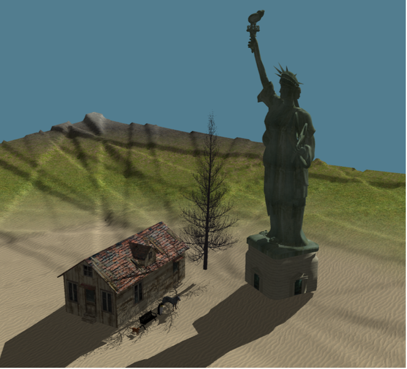

# Interactive World Building Game 🌄

An interactive, real-time sandbox-style terrain manipulation and world-building game developed as a final project for COMP510. The game allows players to modify terrain, paint textures, place objects, and experience dynamic day/night cycles with realistic lighting and shadows.

## 🚀 Features

- **Terrain Editing:** Dig, flatten, and raise terrain in real-time.
- **Texture Painting:** Apply and blend various terrain textures (e.g., snow, dirt, grass).
- **Object Placement:** Place objects like houses, cats, and dogs on the terrain.
- **Dynamic Lighting:** Simulated sun and moon cycles with realistic per-fragment Blinn-Phong shading.
- **Shadow Mapping:** Two-pass depth-buffer shadow rendering.
- **Water Rendering:** Simulated water with refraction, reflection, and animated wave distortion (system developed but not included in final demo).
- **Audio System:** Background music with SFML, streamed efficiently.
- **UI System:** Custom buttons and animated dropdown menus.
- **Raycasting:** Cursor-to-grid interaction for terrain editing and object placement.

## 🖼 Screenshots

  
  
  
  
  
  

## 🧱 System Architecture Overview

### Terrain System
- **BaseGrid (Abstract):** Base interface for grid-related operations.
- **TerrainGenerator:** Procedural height maps including calderas, craters, and faults.
- **GridMesh:** Generates vertex and index buffers for GPU rendering. Assigns textures by elevation.
- **TerrainGrid:** Handles editing operations like digging, flattening, and painting using interpolation.

### Camera
- Custom camera implementation with perspective projection.
- Rodrigues’s formula used to avoid gimbal lock in pitch rotation.

### Lighting & Shadows
- **CelestialLightManager:** Calculates sun/moon direction and color transitions.
- **Shader Implementation:** Vertex and fragment shaders implement full Blinn-Phong lighting.
- **Shadow Mapping:** Two-pass rendering using depth maps and light-space transformation.

### Water System *(developed but not included in final demo)*
- Reflection & refraction using FBOs.
- DuDv and normal maps simulate wave motion.
- Fresnel blending based on view angle.

### Audio System
- **AudioManager (Singleton):** Plays and loops music using SFML.

### UI System
- Lightweight UI framework with base `UIElement` class.
- Buttons and animated dropdowns for object selection and control.

### Object Management
- **ObjectLoader:** Loads and prepares .obj/.mtl assets using Assimp.
- **GameObject:** Adds transforms and bounding boxes.
- **GameObjectManager:** Factory for instantiating and managing objects.
- **ObjectConfig:** Parses configuration files to auto-populate UI.

### Raycasting
- Converts screen-space to world-space via inverse view-projection.
- Supports texture painting, terrain manipulation, and object placement.

## 🛠️ Technologies Used

- **C++ & OpenGL**: Core logic and rendering
- **GLSL**: Shader programming
- **SFML**: Audio streaming
- **Assimp**: 3D model loading
- **Custom Engine Components**: UI, camera, terrain, lighting

## 👥 Team

- Tuna Çimen  
- Ahmet Neçirvan Doğan  
- Eray Önder  
- Ada Yıldız  
